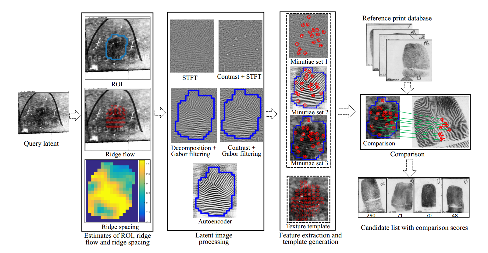

# MSU Latent Automatic Fingerprint Identification System (AFIS) 
A system for identifying latent fingerprints. 

Created at [Michigan State University](https://www.msu.edu) by [Anil K. Jain](https://www.cse.msu.edu/~jain/), [Kai Cao](https://scholar.google.com/citations?user=aA2HStQAAAAJ&hl=en), [Dinh-Luan Nguyen](https://luannd.github.io/), and [Cori Tymoszek](https://github.com/ctymoszek).



## Demo video
[](http://www.youtube.com/watch?v=IRoIF6PzhmY "MSU Latent AFIS")

##  News
| Date     | Update |
|----------|--------|
| 2019-04-24 | Template extraction and Matching code |

## Requirements
Feature extraction code:
Please refer to [environment.yml](environment.yml) file

Matching code:
Please install the required C++ dependencies:
- [Boost](https://www.boost.org/users/download/) (system and filesystem modules)
- [OpenMP](https://www.openmp.org)
- [Eigen](http://eigen.tuxfamily.org/index.php?title=Main_Page)

## Models
Please download the models from [Google Drive](https://drive.google.com/drive/folders/1G5NCrTPP5iSOfaPTG5J3pBH7fiTRA_Xd?usp=sharing). 

## Getting Started
Place the `models` folder in the root of the repository (same level as `extraction` and `matching` folders).

Further detailed instructions for installation and use can be found in the [User Guide PDF](MSU_Latent_AFIS_User_Guide.pdf).
Short instructions:
Use this command to create the environment and install the packages:
```
conda env create -n latentafis -f environment.yml
```
After conda is finished creating the environment and installing the packages, activate the new environment:
```
conda activate latentafis
```
On some systems, you may need to use:
```
source activate latentafis
```

In the case of Tensorpack, the correct version is not available through conda. To install through pip, use these commands:
```
pip install opencv-python==3.4.2.17
pip install tensorpack==0.8.9
```

Change ``` afis.config ``` file for your custom path.

### Template Training
The files for training are located in ```latentafis/training/```, where there is one Python file for each of the three models. The usage for these scripts is as follows:
```
python scriptname.py /path/to/training/data/ /path/to/save/model/
```
### Template Extraction
There are two scripts to do this extraction - one for the latent images (```latentafis/extraction/extraction latent.py```), and one for the rolled reference images (```latentafis/extraction/extraction rolled.py```). The general format of the usage is the same for both:
```
python scriptname.py --flag1=/path/to/a/folder/ --flag2=/path/to/another/folder/
```
Available flags for both ```extraction latent.py``` and ```extraction rolled.py``` are:

• ```--idir=/path/to/image/folder/```: This flag points to a directory where all the images inside should be processed.

• ```--tdir=/path/to/template/folder/```: This flag points to a directory where all the generated templates should be saved. Note that the software is configured to overwrite existing templates at this location in the case of name conflicts.

### Matching
The C++ code to perform matching/identification is located in ```latentafis/matching/```. First, the code must be compiled with the make command. Second, we need to configure the location of the included libraries:
```
sudo ldconfig /somepath/LatentAFIS/matching/boost/stage/lib
```
where ```/somepath/``` is replaced by the location of the LatentAFIS folder. After that, the usage is as follows:
```
./match -flag /path/to/something
```
The flags available for the matcher are:

• ```-l```: This flag is analogous to the ```--i``` flag in the feature extraction scripts. It specifies the path to a single .dat file for the latent query template.

• ```-ldir```: This flag is analogous to the ```--idir``` flag in the feature extraction scripts. It specifies the path to a directory of latent .dat files for batch matching. The matcher will generate one score file for each latent in the directory.

• ```-g```: This flag specifies the path to the directory containing the templates (as .dat files) for the rolled gallery.

• ```-s```: This flag specifies the path to the directory where score files should be saved. Note that these will overwrite any existing score files at this location.

• ```-c```: This flag specifies the path to a codebook file needed by the matcher. The codebook is provided, and should be located in the same folder as the matcher. The file name should be something like ```codebook EmbeddingSize 96 stride 16 subdim 6.dat```.


## Citations:
Please cite following papers:

1. K. Cao, D. Nguyen, C. Tymoszek, A. K. Jain, ["End-to-end Latent Fingerprint Search"](https://arxiv.org/abs/1812.10213), MSU Technical Report MSU-CSE-18-3, 2018.
```
@article{cao2018end,
  title={End-to-End Latent Fingerprint Search},
  author={Cao, Kai and Nguyen, Dinh-Luan and Tymoszek, Cori and Jain, AK},
  journal={arXiv preprint arXiv:1812.10213},
  year={2018}
}
```
2. D. Nguyen, K. Cao, A. K. Jain, ["Automatic Latent Fingerprint Segmentation"](https://arxiv.org/abs/1804.09650), in BTAS, 2018. 
```
@inproceedings{nguyen2018automatic,
  title={Automatic latent fingerprint segmentation},
  author={Nguyen, Dinh-Luan and Cao, Kai and Jain, Anil K},
  booktitle={IEEE International Conference on BTAS},
  year={2018}
}
```
3. K. Cao, A. K. Jain, ["Latent Fingerprint Recognition: Role of Texture Template"](https://arxiv.org/abs/1804.10337), in BTAS, 2018. 
```
@article{cao2018latent,
  title={Latent Fingerprint Recognition: Role of Texture Template},
  author={Cao, Kai and Jain, Anil K},
  journal={arXiv preprint arXiv:1804.10337},
  year={2018}
}
```
4. D. Nguyen, K.Cao, A. K. Jain, ["Robust Minutiae Extractor: Integrating Deep Networks and Fingerprint Domain Knowledge"](https://arxiv.org/pdf/1712.09401.pdf), in ICB, 2018. 

```
@inproceedings{Nguyen_MinutiaeNet,
author    = {Dinh-Luan Nguyen and Kai Cao and Anil K. Jain},
title     = {Robust Minutiae Extractor: Integrating Deep Networks and Fingerprint Domain Knowledge},
booktitle = {The 11th International Conference on Biometrics, 2018},
year      = {2018},
}
```

5. K. Cao and A. K. Jain, ["Automated Latent Fingerprint Recognition"](https://arxiv.org/abs/1704.01925), in the IEEE TPAMI, DOI 10.1109/TPAMI.2018.2818162, 2018.

```
@article{cao2019automated,
  title={Automated latent fingerprint recognition},
  author={Cao, Kai and Jain, Anil K},
  journal={IEEE transactions on pattern analysis and machine intelligence},
  volume={41},
  number={4},
  pages={788--800},
  year={2019},
  publisher={IEEE}
}
```
